# Big mart sales data visualization
This project based on **Django** (Python) Web Application.

## Keyword
Product analysis, store 
analysis, matplotlib, pandas,
numpy, product sales of market, 
store sales of market and big mart
<br>
<br>
## Abstract
This project focuses on the visualization of sales data for a fictional retail chain, Big Mart, using the Python programming language and the Matplotlib data visualization library. The main objective of this project is to provide insights into the sales trends of the retail chain using graphical representations such as line charts, bar charts, scatter plots, and histograms. The data used in this project is a sample dataset provided by Big Mart, which contains information on sales, product attributes, and store demographics. The project first cleans and preprocesses the data to make it suitable for analysis and visualization. Then, using Matplotlib, the project creates various visualizations that can help stakeholders understand the sales trends of the retail chain. These visualizations include sales 4 by product category, sales by store size, sales by location, and sales trends over time. The project concludes by summarizing the insights gained from the visualizations and discussing the implications of these insights for the business. Overall, this project demonstrates the power of Python and Matplotlib for analyzing and visualizing complex datasets and providing valuable insights to businesses.
<br>
<br>


## Objective
* The current system have poor visualization design, which could make it difficult for users to understand the data and insights presented.

* To develop a visualization the row data on various features of Matplotlib and Pandas.
<br>
<br>

## Functional Requirement
1. User can able to insert dataset.

2. The System should able to generate graphical representation of inserted dataset.

3. The system should be able to analyze sales data to identify trends, patterns and insights.

4. It should analyze the data and give most profitable items & most loss-making items.
<br>
<br>


## Prerequisites
1. Install PIP
2. Install Django
3. Any Editor (preferably VS Code)
4. Any Web Browser
<br>
<br>

## Languages and Technologies used:
* HTML5/CSS3
* JavaScript (for Basic Functionality)
* Django (Python Web Framework)
* MySQL (for Authentication)
<br>
<br>

## Python Libraries:
> Matplotlib

> Pandas

> Numpy

<br>
<br>

## Block Diagram:
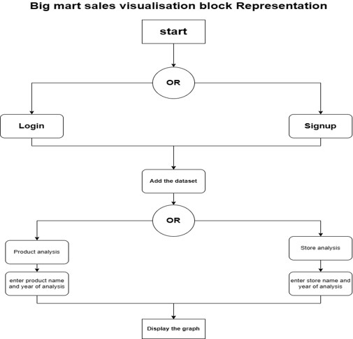
<br>
<br>

## Future Scope:
We can extend this idea by providing following features,
1. Customizable analysis options: While the system currently provides pre-defined product and store analysis options, we can consider adding the ability for users to customize their own analysis options based on their specific business needs.

2. Mobile app: To make the system more accessible to users on the go, we can consider developing a mobile app that allows users to upload datasets, view analysis results, and receive alerts for important sales trends.

3. Predictive analytics: As mentioned earlier, we can extend the system's functionality by incorporating AI and ML algorithms to provide predictive analytics capabilities. This would enable users to forecast future sales trends and make data-driven decisions based on those forecasts.

4. Showing not only showing the relationship between quantities and visualizing them but we can also extend this    idea up to prediction of sales using AI and ML algorithms.
<br>
<br>


## Steps to Run Project:
1. Intsall Virtual Environment
   ```
   py -m venv myWorld
   ```
2. Activate Virtual Environment
   ```
   myWorld\Scripts\activate
   ```
3. Install django in virtual environment
   ```
   python -m pip install Django
   ```
4. Create Django project and app
   ```
   django-admin startproject martSales
   ```
5. Create Django project and app (App must be in project)
   ```
   //project
   django-admin startproject martSales

   //app
   python manage.py startapp myApp
   ```

6. Set up all repository files in martSales project folder and myApp folder.

7. Install All Libraries which are in the code.

8. Make changes in SignIn code. 

9. Run Project from current project directory
   ```
   python manage.py runserver
   ```
<br>
<br>

## Getting into the Project:
1. Login Page
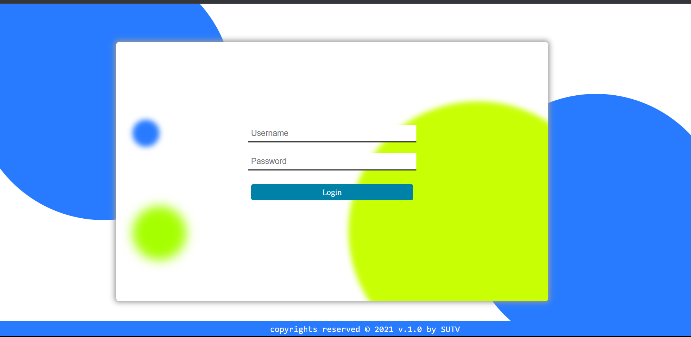

2. Options\
   We Visualize data based on Stores and Product
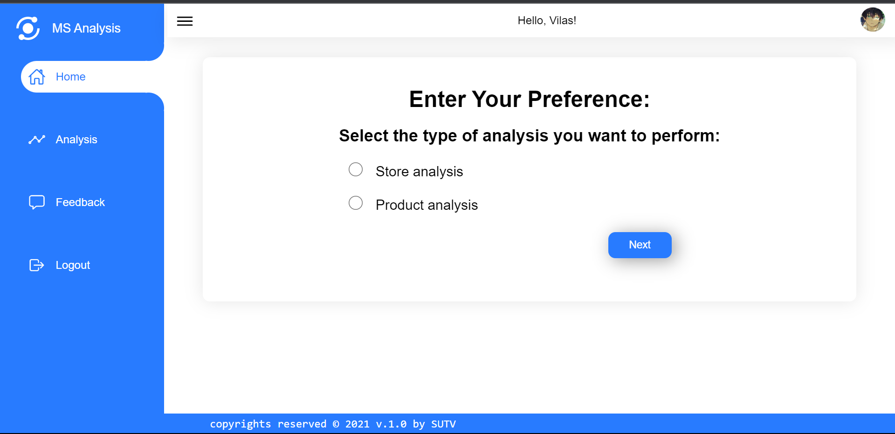

3. Store Analysis
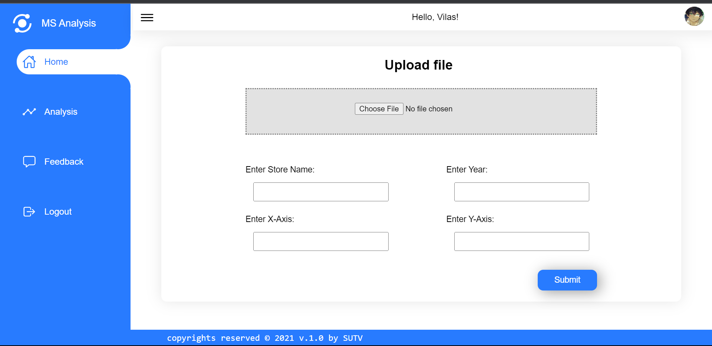

4. Store Analysis result
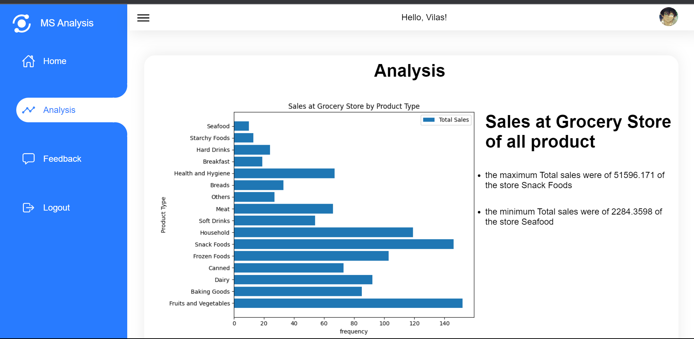
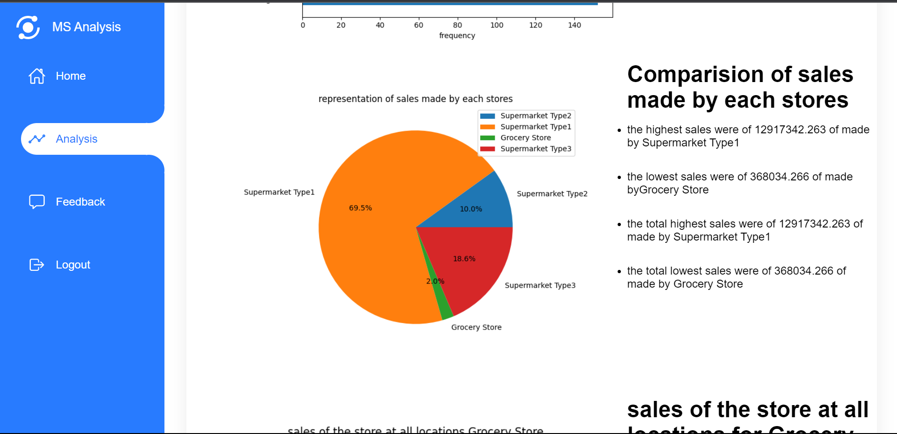
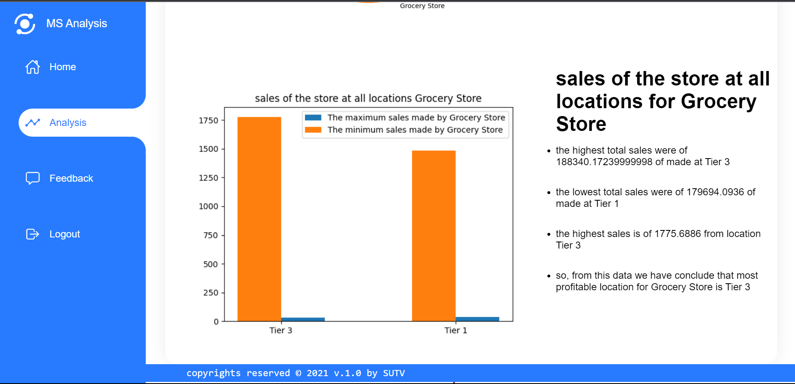

5. Product Analysis
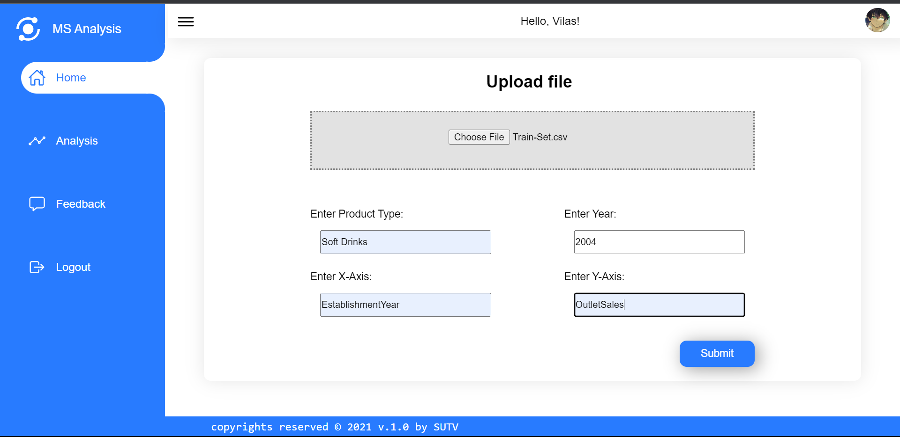

6. Product Analysis Result
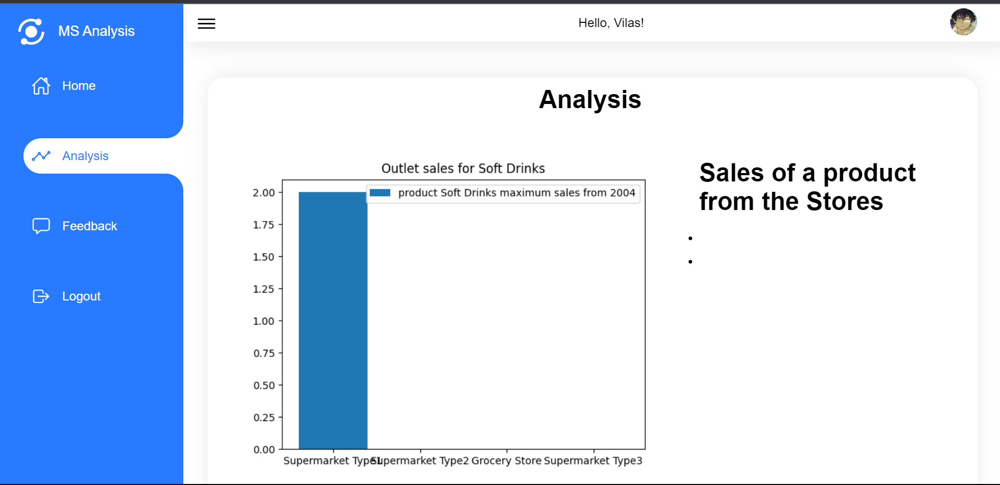
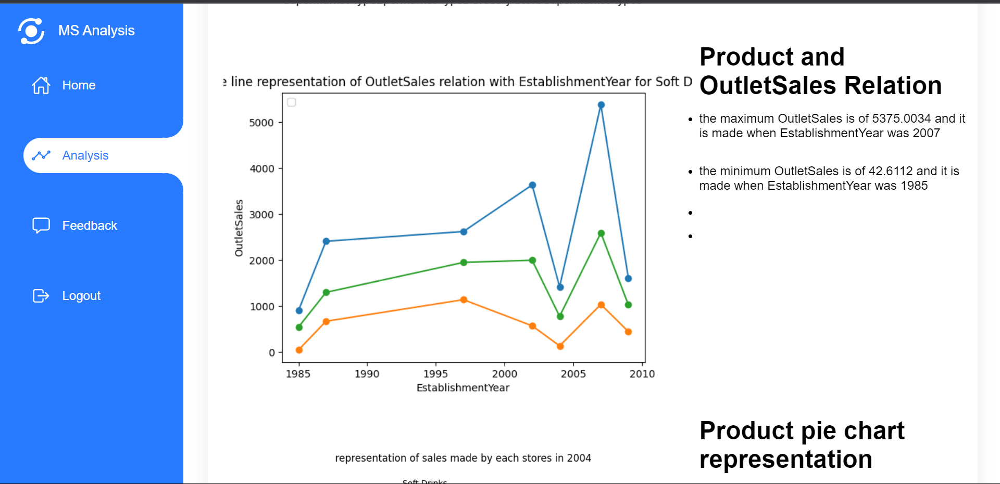
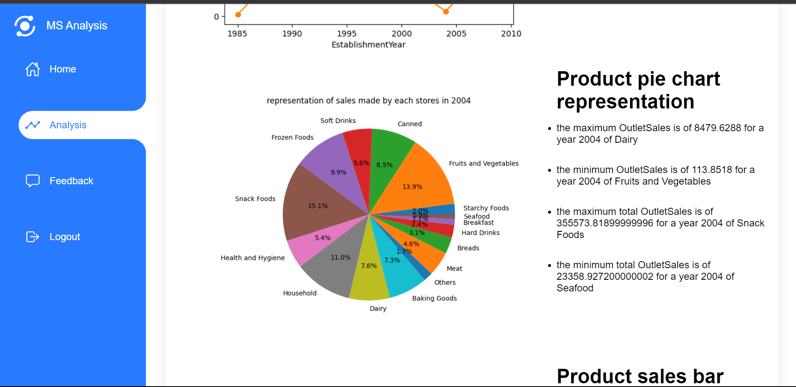
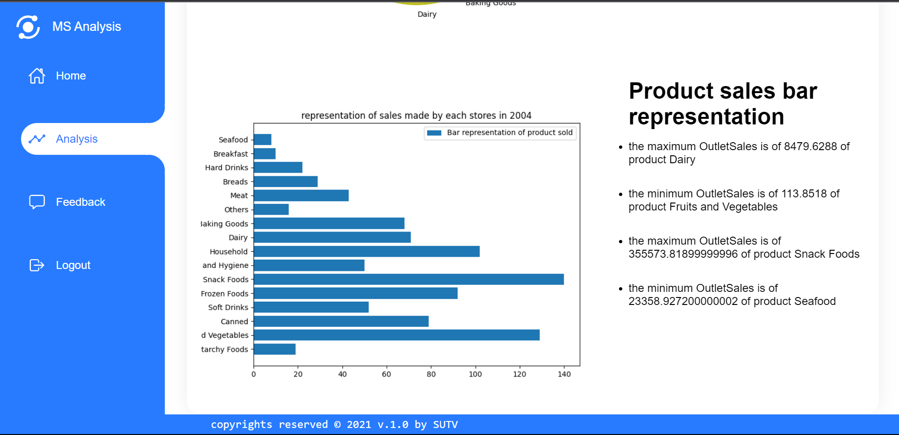
<br>
<br>

## Need to work on:
1. Giving Sign Up Option (New Resistration).

2. Need to implement another way to generate images and show on web page, beacause in this we save graph images in local machine & then showing it.
<br>
<br>

## Conclusion
Big Mart Sales Visualization 
using Python and Matplotlib is a 
comprehensive solution for 
analyzing and visualizing sales data 
for retail chains like Big Mart. The 
system provides valuable insights 
and recommendations to improve sales and profitability. It uses 
Python and its various libraries like 
Pandas, Numpy, and Matplotlib to 
analyze and visualize sales data. 
The visualizations can be made 
interactive using libraries like Plotly 
and Bokeh, allowing users to 
explore the data in realtime. The 
system is scalable and adaptable, 
making it suitable for analyzing 
sales data across different stores, 
regions, and time periods. With this 
project, businesses in the retail 
industry can make informed 
decisions to stay ahead of the 
competition and improve their 
bottom line
